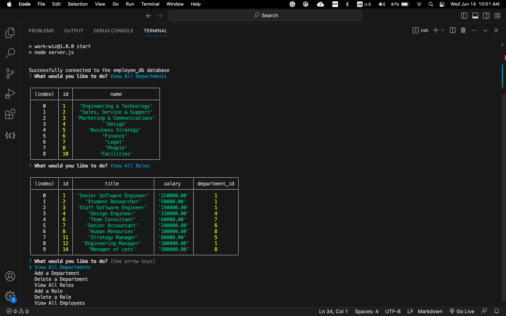

# work-wiz

## Description

Deployed application link on Heroku
https://green-scribbles.herokuapp.com/

Github link
https://github.com/itcreativeusa/work-wiz

This is a WorkWiz employee tracker a command-line application that can be used to add, save & delete employees, roles and departments. Application uses Node.js, Inquirer, and MySQL to manage a company's employee database.

## Table of Contents 

- [Installation](#installation)
- [Usage](#usage)
- [Requirements](#requirements)
- [Credits](#credits)
- [License](#license)

## Installation

No special requirements. 
 
## Requirements

No special requirements

## Usage

Use command-line to run an application that accepts user input.
Start the application
to be presented with the following options: view all departments, view all roles, view all employees, add a department, delete department, add a role, delete a role, add an employee, delene an employee and update an employee role.

Screenshot located in `./assets/` folder

## Credits
 
Some code in file `server.js` was taken from Mini-Project provided by Berkeley Bootcamp for studying purposes.

## License

Please refer to the LICENSE in the repo.